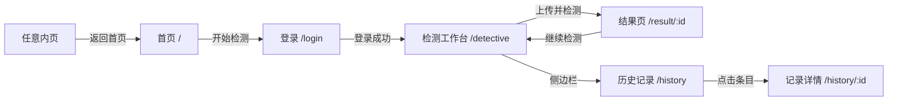

# FaceShield 前端详细讲解文档

> 版本：MVP  
> 技术栈：Vue 3 + Vite 7 + Vue Router 4 + Axios  
> 默认端口：5173（前端） / 8000（后端 API）

---

## 1. 项目概述

FaceShield 前端是一个 **AI 换脸诈骗 · 伪造人脸检测系统** 的可演示界面。系统面向单张图片检测场景，用户上传 JPG/PNG 人脸图片后，前端调用后端 API 完成检测，并展示：

- 模型二分类结果
- 伪造概率（环形图）
- 风险等级（低 / 中 / 高）
- 频域 / 空域特征分数
- 原图、人脸裁剪图、Grad-CAM 热力图
- 历史检测记录查询

前端采用 **页面（views）+ 功能模块（features）+ 共享组件（shared）** 的分层结构，页面只负责组合与路由跳转，业务逻辑集中在 `features/` 与各 `service` 中。

---

## 2. 技术栈说明

| 技术 | 用途 |
|------|------|
| **Vue 3** | 组合式 API（`<script setup>`）构建 UI |
| **Vite 7** | 开发服务器、热更新、生产构建 |
| **Vue Router 4** | 单页应用路由、登录守卫 |
| **Axios** | HTTP 请求，统一拦截 Token 与 401 |
| **原生 CSS** | 全局样式 + 组件 scoped 样式，无 UI 框架 |

未引入 Pinia / Element Plus，状态使用轻量 `reactive` store，适合 MVP 快速演示。

---

## 3. 目录结构总览

```text
frontend/
├── public/                          静态资源（不参与打包编译）
│   └── images/
│       └── home-hero-bg.png         首页 Hero 背景图
├── docs/
│   └── 前端详细讲解.md               本文档
├── src/
│   ├── main.js                      应用入口
│   ├── App.vue                      根组件（布局切换）
│   ├── config/
│   │   └── app.config.js            应用名、API 地址
│   ├── constants/
│   │   └── routes.js                路由名、侧边栏导航项
│   ├── router/
│   │   └── index.js                 路由表 + 登录守卫
│   ├── layouts/
│   │   └── AppLayout.vue            带侧边栏的应用壳
│   ├── views/                       页面（按业务域分子目录）
│   │   ├── home/HomeView.vue
│   │   ├── auth/LoginView.vue
│   │   ├── detective/DetectiveView.vue
│   │   ├── result/ResultView.vue
│   │   └── history/HistoryView.vue, HistoryDetailView.vue
│   ├── features/                    功能模块
│   │   ├── auth/services/
│   │   ├── home/components/
│   │   ├── detection/
│   │   │   ├── components/upload/   上传组件
│   │   │   ├── components/result/   结果展示组件
│   │   │   ├── components/DetectionGuidePanel.vue
│   │   │   └── services/
│   │   └── history/
│   ├── shared/components/           跨模块通用 UI
│   ├── stores/                      全局 reactive 状态
│   ├── services/http.js             Axios 实例
│   ├── composables/                 可复用组合式函数
│   ├── utils/                       工具函数
│   └── styles/global.css            全局样式
├── vite.config.js                   Vite 配置（含 @ 别名）
└── package.json
```

### 3.1 分层职责

| 层级 | 目录 | 职责 |
|------|------|------|
| **入口层** | `main.js`, `App.vue` | 挂载应用、切换布局 |
| **页面层** | `views/` | 路由级页面，组合 features 组件 |
| **功能层** | `features/` | 业务组件 + API 封装 |
| **共享层** | `shared/` | 与业务无关的通用组件 |
| **基础设施** | `services/`, `utils/`, `stores/` | HTTP、格式化、状态 |

### 3.2 路径别名

`vite.config.js` 配置了 `@` → `src/`：

```javascript
import DetectiveView from '@/views/detective/DetectiveView.vue'
import { uploadAndDetect } from '@/features/detection/services/detection.service'
```

---

## 4. 启动与环境配置

### 4.1 安装与运行

```bash
cd frontend
npm install
npm run dev      # 开发模式 http://127.0.0.1:5173
npm run build    # 生产构建，输出到 dist/
npm run preview  # 预览构建结果
```

### 4.2 环境变量

可在项目根目录创建 `.env.local`：

```env
VITE_API_BASE_URL=http://localhost:8000/api
VITE_STORAGE_BASE_URL=http://localhost:8000
```

| 变量 | 默认值 | 说明 |
|------|--------|------|
| `VITE_API_BASE_URL` | `http://localhost:8000/api` | 后端 REST API 前缀 |
| `VITE_STORAGE_BASE_URL` | `http://localhost:8000` | 静态文件（图片、热力图）基址 |

配置读取位置：`src/config/app.config.js`

### 4.3 演示账号

```text
用户名：demo
密码：demo123456
```

---

## 5. 路由与页面导航

### 5.1 路由表

| 路径 | 路由名 | 页面组件 | 需登录 | 布局 |
|------|--------|----------|--------|------|
| `/` | `home` | HomeView | 否 | 独立全屏（standalone） |
| `/login` | `login` | LoginView | 否 | 独立全屏 |
| `/detective` | `detective` | DetectiveView | **是** | 侧边栏 AppLayout |
| `/detection` | — | 重定向到 `/detective` | — | — |
| `/result/:id` | `result` | ResultView | **是** | AppLayout |
| `/history` | `history` | HistoryView | **是** | AppLayout |
| `/history/:id` | `historyDetail` | HistoryDetailView | **是** | AppLayout |

路由定义文件：`src/router/index.js`

### 5.2 路由守卫逻辑

```text
访问受保护页面且未登录
  → 跳转 /login?redirect=原目标路径

已登录用户访问 /login
  → 跳转 /detective

公开页面（meta.public = true）
  → 直接放行
```

### 5.3 典型用户流程



---

## 6. 布局系统

### 6.1 App.vue — 双布局切换

```vue
<RouterView v-if="route.meta.standalone" />   <!-- 首页、登录：无侧边栏 -->
<AppLayout v-else>                             <!-- 业务页：带侧边栏 -->
  <RouterView />
</AppLayout>
```

- **standalone 布局**：首页、登录页，全屏 Hero 风格
- **AppLayout 布局**：检测、结果、历史等业务页面，左侧固定导航

### 6.2 AppLayout.vue — 应用壳

组成部分：

1. **品牌区**（可点击回首页 `/`）
2. **导航菜单**（首页 / 图片检测 / 历史记录）
3. **用户区**（显示用户名 + 退出登录）

导航高亮通过 `$route.name === item.name` 精确匹配，避免 `/` 路径误匹配所有页面。

---

## 7. 页面详解

### 7.1 首页 — `views/home/HomeView.vue`

**作用**：系统 Landing 页，面向未登录/已登录用户的入口展示。

**组成模块**：

| 组件 | 文件 | 功能 |
|------|------|------|
| HomeNav | `features/home/components/HomeNav.vue` | 顶部导航、登录入口 |
| HomeHero | `features/home/components/HomeHero.vue` | 大标题 FaceShield、描述、开始检测按钮 |
| HomeDetectBar | `features/home/components/HomeDetectBar.vue` | 底部快速检测栏 |
| 核心能力区 | HomeView 内联 | 四宫格功能介绍 |

**背景图**：`public/images/home-hero-bg.png`（人脸识别科技风）

**交互**：

- 「开始检测」→ `/login?redirect=/detective`
- 已登录用户导航中「图片检测」→ `/detective`

---

### 7.2 登录页 — `views/auth/LoginView.vue`

**作用**：用户名密码登录，获取 JWT Token。

**流程**：

1. 用户输入账号密码
2. 调用 `auth.service.login()`
3. 成功后将 `access_token` 和 `user` 写入 `authStore` + `localStorage`
4. 跳转到 `redirect` 查询参数指定路径，默认 `/detective`

**Token 存储键**：

- `faceshield_access_token`
- `faceshield_user`

---

### 7.3 检测工作台 — `views/detective/DetectiveView.vue`

**作用**：核心检测页面，上传图片并发起检测。

**布局**：

- **顶部 Banner**：FaceShield 品牌、功能说明、技术标签
- **左侧**：`DetectionFileUploader` 上传区 + loading / 错误提示
- **右侧**：`DetectionGuidePanel` 检测流程与使用说明

**检测流程**：

```text
用户选择/拖拽图片
  → detectionStore.currentFile 保存 File 对象
  → 点击「开始检测」
  → uploadAndDetect(file)  POST /detection/upload-and-detect
  → normalizeDetectionResult() 统一字段
  → detectionStore.setResult(result)
  → router.push('/result/:taskId')
```

**使用 composable**：`useAsyncTask()` 统一管理 loading / error 状态。

---

### 7.4 检测结果页 — `views/result/ResultView.vue`

**作用**：展示单次检测的完整结果。

**数据来源（优先级）**：

1. `detectionStore.latestResult`（刚检测完跳转过来，无需二次请求）
2. `GET /records/:id`（刷新页面或直接访问 URL 时拉取）

**展示组件**：`DetectionResultPanel`（见 8.3 节）

**操作按钮**：返回首页、继续检测、历史记录

---

### 7.5 历史记录页 — `views/history/HistoryView.vue`

**作用**：分页展示当前用户的检测历史。

**功能**：

- 按模型二分类结果（real/fake）、风险等级筛选
- 分页（每页 10 条）
- 表格展示缩略图、文件名、模型结果、概率、风险、时间
- 点击行或「查看详情」→ `/history/:id`

**API**：

- 无筛选：`GET /records?page=&page_size=`
- 有筛选：`GET /history/list?label=&risk_level=`

---

### 7.6 记录详情页 — `views/history/HistoryDetailView.vue`

**作用**：展示单条历史记录的完整检测结果（与结果页 UI 一致）。

**API**：`GET /records/:taskId`

---

## 8. 功能模块（features）

### 8.1 auth — 认证模块

**服务**：`features/auth/services/auth.service.js`

| 方法 | API | 说明 |
|------|-----|------|
| `login(username, password)` | `POST /auth/login` | 登录 |
| `logout()` | `POST /auth/logout` | 退出 |
| `getCurrentUser()` | `GET /auth/me` | 当前用户（预留） |

---

### 8.2 detection — 检测模块

#### 8.2.1 服务层

**文件**：`features/detection/services/detection.service.js`

| 方法 | API | 说明 |
|------|-----|------|
| `uploadAndDetect(file)` | `POST /detection/upload-and-detect` | 上传 + 检测（主流程） |
| `getDetectionDetail(taskId)` | `GET /records/:id` | 获取检测详情 |
| `startDetection(fileId)` | `POST /detection/start` | 按 file_id 检测（预留） |

所有返回值经 `normalizeDetectionResult()` 转为前端统一 camelCase 结构。

#### 8.2.2 上传组件

**文件**：`features/detection/components/upload/DetectionFileUploader.vue`

- 支持拖拽与点击选择
- 限制格式：JPG / JPEG / PNG
- 本地预览（`URL.createObjectURL`）
- `v-model` 绑定 `File` 对象
- `@submit` 事件触发检测

#### 8.2.3 结果展示组件组

**目录**：`features/detection/components/result/`

| 组件 | 功能 |
|------|------|
| `DetectionResultPanel` | 结果主面板，组合以下子组件 |
| `ProbabilityGauge` | 伪造概率环形图，颜色随风险等级变化 |
| `RiskBadge` | 低/中/高风险中文徽章 |
| `ScoreBar` | 频域 / 空域分数进度条 |
| `HeatmapViewer` | Grad-CAM 热力图，支持叠加显示 |

#### 8.2.4 引导面板

**文件**：`features/detection/components/DetectionGuidePanel.vue`

展示检测四步流程、融合分析说明、使用提示。

---

### 8.3 DetectionResultPanel 数据结构

组件接收的 `result` 对象（已由 `normalizeDetectionResult` 处理）：

| 字段 | 类型 | 说明 |
|------|------|------|
| `taskId` | number | 记录/任务 ID |
| `fileId` | number | 文件 ID |
| `label` | `'real'` \| `'fake'` | 模型二分类结果 |
| `fakeProbability` | number | 伪造概率 0~1 |
| `confidence` | number | 模型置信度 |
| `riskLevel` | `'low'` \| `'medium'` \| `'high'` | 风险等级 |
| `frequencyScore` | number | 频域分支分数 |
| `spatialScore` | number | 空域分支分数 |
| `heatmapUrl` | string \| null | 热力图路径 |
| `faceCropUrl` | string \| null | 人脸裁剪图路径 |
| `faceDetected` | boolean | 是否检测到人脸 |
| `suggestion` | string | 风险提示语 |
| `modelName` / `modelVersion` | string | 模型信息 |
| `createdAt` | string | 检测时间 |
| `originalFilename` | string | 原始文件名 |
| `originalImageUrl` | string | 原图 URL 路径 |

---

### 8.4 history — 历史记录模块

**服务**：`features/history/services/history.service.js`

| 方法 | API | 说明 |
|------|-----|------|
| `listHistory(params)` | `/records` 或 `/history/list` | 分页列表 |
| `getHistoryDetail(taskId)` | `GET /records/:id` | 单条详情 |

**表格组件**：`features/history/components/HistoryTable.vue`

---

### 8.5 home — 首页模块

纯展示型模块，无 service 层，仅包含三个 UI 组件（Nav / Hero / DetectBar）。

---

## 9. 共享组件（shared）

| 组件 | 文件 | 用途 |
|------|------|------|
| PageHeader | `PageHeader.vue` | 页面标题 + 描述 + 操作按钮插槽 |
| BackHomeLink | `BackHomeLink.vue` | 「返回首页」链接按钮 |
| LoadingState | `LoadingState.vue` | 加载中提示 + spinner |
| InlineError | `InlineError.vue` | 行内错误信息 |
| EmptyState | `EmptyState.vue` | 空数据占位 + 操作插槽 |
| Pagination | `Pagination.vue` | 上一页 / 下一页分页 |

---

## 10. 状态管理（stores）

采用 Vue 3 `reactive` 对象，未使用 Pinia。

### 10.1 authStore — `stores/auth.store.js`

| 状态/方法 | 说明 |
|-----------|------|
| `token` | JWT 访问令牌 |
| `user` | 当前用户信息 |
| `isAuthenticated` | 计算属性，是否有 token |
| `setSession(token, user)` | 登录成功后写入 |
| `clearSession()` | 退出时清空 |

### 10.2 detectionStore — `stores/detection.store.js`

| 状态/方法 | 说明 |
|-----------|------|
| `currentFile` | 当前待检测的 File 对象 |
| `latestResult` | 最近一次检测结果 |
| `loading` / `error` | 检测过程状态 |

### 10.3 historyStore — `stores/history.store.js`

| 状态/方法 | 说明 |
|-----------|------|
| `items` | 历史列表数据 |
| `total` | 总条数 |
| `setList(payload)` | 更新列表 |

---

## 11. HTTP 与 API 数据流

### 11.1 Axios 实例 — `services/http.js`

```text
请求拦截器
  → 自动附加 Authorization: Bearer <token>

响应拦截器
  → 401 且非登录接口 → 清 session → 跳转 /login
```

### 11.2 统一响应格式

后端返回：

```json
{
  "code": 200,
  "message": "success",
  "data": { ... }
}
```

前端通过 `unwrapApiResponse(response)` 提取 `data` 字段。

错误信息通过 `getApiErrorMessage(error, fallback)` 从 `response.data.message` 读取。

### 11.3 静态资源 URL

后端返回的图片路径如 `/storage/uploads/xxx.jpg`，前端通过 `resolveStorageUrl()` 拼接：

```javascript
// utils/storage.js
resolveStorageUrl('/storage/uploads/xxx.jpg')
// → 'http://localhost:8000/storage/uploads/xxx.jpg'
```

---

## 12. 工具函数（utils）

### 12.1 detection.js — 字段归一化

`normalizeDetectionResult(raw)` 将后端 snake_case 多种格式统一为前端 camelCase：

- `task_id` / `record_id` → `taskId`
- `prediction` / `label` → `label`
- `fake_probability` → `fakeProbability`
- `original_image_url` / `file_url` → `originalImageUrl`

避免不同 API 端点字段名不一致导致 UI 显示 `-`。

### 12.2 formatters.js — 展示格式化

| 函数 | 说明 |
|------|------|
| `formatPercent(value)` | 0.86 → `86%` |
| `formatRiskLevel(level)` | `high` → `高风险` |
| `formatLabel(label)` | `fake` → `模型判为伪造` |
| `formatDateTime(value)` | 中文本地化时间 |
| `riskLevelClass(level)` | 返回 CSS 类名 `risk-low` 等 |

### 12.3 api-response.js

| 函数 | 说明 |
|------|------|
| `unwrapApiResponse(response)` | 解包 `{ code, message, data }` |
| `getApiErrorMessage(error, fallback)` | 提取错误文案 |

---

## 13. Composables

### useAsyncTask — `composables/useAsyncTask.js`

封装异步任务的 loading / error 管理：

```javascript
const { loading, error, run } = useAsyncTask()

const result = await run(
  () => uploadAndDetect(file),
  '检测失败，请稍后重试。'
)
```

- 执行前：`loading = true`, `error = ''`
- 成功：返回 API 结果
- 失败：`error` 写入错误信息，返回 `null`
- 结束：`loading = false`

---

## 14. 样式体系

### 14.1 全局样式 — `styles/global.css`

包含：

- CSS Reset、`body` 字体
- 按钮默认样式
- `.app-shell` / `.sidebar` 侧边栏布局
- `.login-page` / `.login-panel` 登录页
- `.page-header` 页面标题区
- 响应式断点（860px 以下侧边栏变横向）

### 14.2 组件样式

各 `.vue` 文件使用 `<style scoped>`，样式仅作用于当前组件，避免污染。

### 14.3 设计风格

- 主色：绿色 `#166534`（安全、检测通过语义）
- 风险色：绿 / 橙 / 红 对应低 / 中 / 高
- 首页：深色 Hero + 毛玻璃导航
- 工作台：Banner + 双栏卡片布局

---

## 15. 与后端 API 对照表

| 前端调用 | 方法 | 后端路径 | 需 Token |
|----------|------|----------|----------|
| `login()` | POST | `/api/auth/login` | 否 |
| `logout()` | POST | `/api/auth/logout` | 是 |
| `uploadAndDetect()` | POST | `/api/detection/upload-and-detect` | 是 |
| `getDetectionDetail()` | GET | `/api/records/:id` | 是 |
| `listHistory()` | GET | `/api/records` 或 `/api/history/list` | 是 |
| `getHistoryDetail()` | GET | `/api/records/:id` | 是 |

Swagger 文档：`http://localhost:8000/docs`

---

## 16. 开发约定与扩展指南

### 16.1 新增页面

1. 在 `views/<domain>/` 下创建页面组件
2. 在 `router/index.js` 注册路由
3. 若需侧边栏，**不要**设置 `meta.standalone`
4. 若需登录，**不要**设置 `meta.public`
5. 在 `constants/routes.js` 的 `navigationItems` 中添加导航（可选）

### 16.2 新增 API

1. 在对应 `features/<module>/services/` 下添加方法
2. 使用 `http` 实例发请求
3. 用 `unwrapApiResponse()` 解包
4. 检测类数据用 `normalizeDetectionResult()` 归一化

### 16.3 新增组件

- 仅某一功能使用 → `features/<module>/components/`
- 多模块复用 → `shared/components/`

### 16.4 注意事项

1. **热力图**：当前后端 mock 阶段 `heatmap_url` 常为 `null`，前端会显示占位提示
2. **图片格式**：前后端均限制 JPG/PNG，上传前前端会先校验
3. **Token 过期**：401 会自动跳转登录，用户需重新登录
4. **路径别名**：优先使用 `@/` 导入，避免深层 `../../../`

---

## 17. 常见问题（FAQ）

**Q：刷新结果页后数据从哪来？**  
A：`ResultView` 会先检查 `detectionStore.latestResult`，若无则请求 `GET /records/:id`。

**Q：为什么首页能访问但检测页跳登录？**  
A：首页路由设置了 `meta.public: true`，检测页需要 JWT 认证。

**Q：如何修改 API 地址？**  
A：创建 `.env.local` 设置 `VITE_API_BASE_URL`，或修改 `config/app.config.js`。

**Q：构建产物在哪？**  
A：执行 `npm run build` 后输出到 `frontend/dist/`，可部署到任意静态服务器，需配置 SPA fallback。

---

## 18. 文件索引速查

| 你想了解… | 去看这个文件 |
|-----------|-------------|
| 路由与守卫 | `src/router/index.js` |
| 登录逻辑 | `src/views/auth/LoginView.vue` |
| 上传检测 | `src/views/detective/DetectiveView.vue` |
| 结果展示 | `src/features/detection/components/result/DetectionResultPanel.vue` |
| 历史列表 | `src/views/history/HistoryView.vue` |
| HTTP 配置 | `src/services/http.js` |
| Token 存储 | `src/stores/auth.store.js` |
| 字段映射 | `src/utils/detection.js` |
| 全局样式 | `src/styles/global.css` |
| 环境配置 | `src/config/app.config.js` |

---

*文档随代码结构更新，如有新增模块请同步维护本节内容。*
